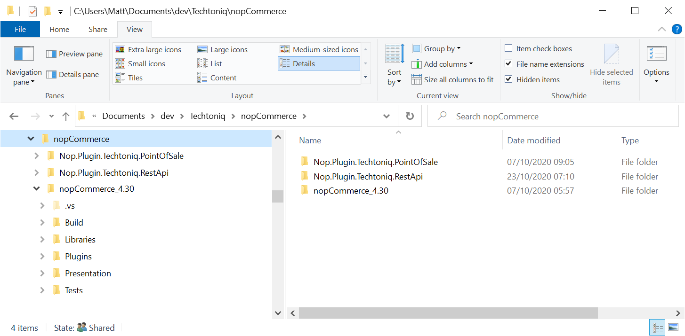
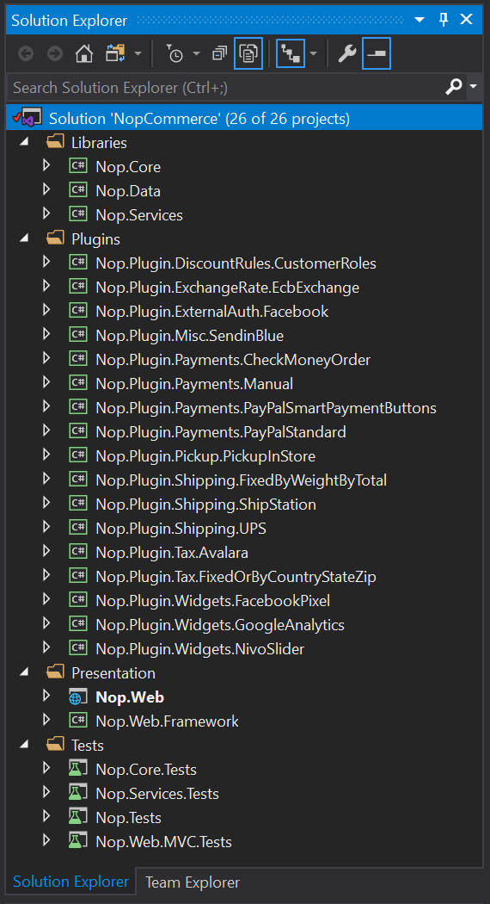
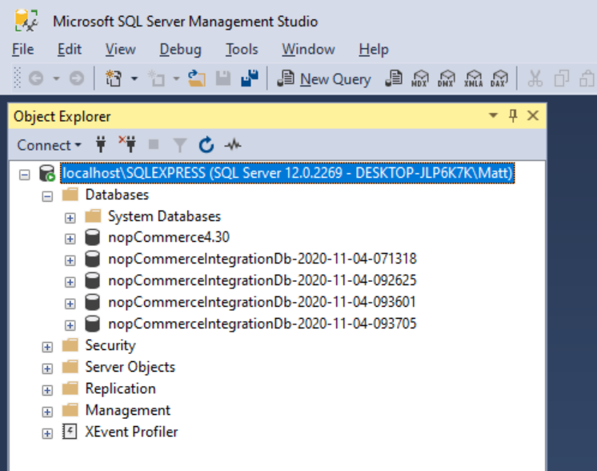

# Integration Test Framework for nopCommerce Plugin Development

Having recently embarked on some plugin development it became apparent that integration testing was going to be a challenge. There wasn't anything out of the box in the nopCommerce solution which facilitied integration testing and a search on the community forum didn't yield anything tangible. So I spent some time putting together my own integration test framework, and thought I'd share it here incase other developers find it useful.


## What is Integration Testing?

Different developers have different interpretations of what integration testing means so let me start by defining what I mean by integration testing in this context. When integration testing a plugin I want to be able to do two things:

1. Make HTTP requests to a running nopCommerce instance, and assert on the HTTP responses.
2. Resolve services from the DI container in a running nopCommerce instance, execute methods on them, and assert on the results.

With this in mind let me share the objectives for my integration test framework.


## Objectives for my nopCommerce Integration Test Framework

I wanted the integration test framework to meet the following objectives:

- Provide a running instance of nopCommerce in a known state.
- Allow two types of repeatable integration tests to be executed against that running nopCommerce instance:
  - Sending HTTP requests and asserting on the HTTP response.
  - Resolving services from the DI container, executing methods on those services and asserting on the return value.
- Operate completely stand alone on a developer's machine.
- Have no impact on the live nopCommerce instance.
- Make no changes to nopCommerce source code or configuration.
- Honour DRY principles - avoiding having to duplicate chunks of nopCommerce code in the test framework.

With these objectives set let me take you through the solution I created. In order to demonstrate it we'll create a simple plugin for nopCommerce 4.30 as an example.


## Development Environment Setup

Firstly a word on how to structure the development environment. There is a root folder called `nopCommerce`. Within this there are folders for each nopCommerce source distribution (with the version number appended to the folder name) and a folder for each plugin being developed. 



The key point about this structure is that **each plugin folder contains its own nopCommerce solution file**. This is a copy of the solution file from the nopCommerce source, but with the paths to the nopCommerce source projects tweaked accordingly. This isolates and preserves the original nopCommerce source distribution and provides a couple of additional benefits:
- plugins can be developed independently
- different nopCommerce versions can be used

For the database, I'm using SQL Express.

The IDE is Visual Studio 2019.

The integration test framework requires that the development environment is set up as described above.


## Creating an Example nopCommerce 4.30 Plugin

The example plugin contains the minimum code necessary for an installable plugin together with a placeholder configuration page so that we can demonstrate an integration test. To kick off we need to create the solution:

1. Create a new folder under the nopCommerce root folder for the plugin. For example, `Nop.Plugin.Techtoniq.Example`.

2. Copy the `NopCommerce.sln` file from `nopCommerce_4.30` to the new folder.

3. Edit the solution file in your preferred text editor and append `..\nopCommerce_4.30\` to each of the project paths in the solution file. So for example:

  > `Project("{9A19103F-16F7-4668-BE54-9A1E7A4F7556}") = "Nop.Web", "Presentation\Nop.Web\Nop.Web.csproj", "{4F1F649C-1020-45BE-A487-F416D9297FF3}"`

  in the nopCommerce source becomes:

  > `Project("{9A19103F-16F7-4668-BE54-9A1E7A4F7556}") = "Nop.Web", "..\nopCommerce_4.30\Presentation\Nop.Web\Nop.Web.csproj", "{4F1F649C-1020-45BE-A487-F416D9297FF3}"`

  in the new solution file.

Once all the project paths have been updated, save the file and open it in Visual Studio and with a bit of luck it should look exactly as if you had opened the solution file that is in the nopCommerce source distribution folder:



Now add a new "Class Library (.NET Standard)" project under the Plugins solution folder in Visual Studio and save it in a new `Src` subfolder of your plugin folder.

Edit the project file in Visual Studio, based on the steps described in this article: [How to write a plugin for nopCommerce](https://docs.nopcommerce.com/en/developer/plugins/how-to-write-plugin-4.30.html) but remember to set the `OutputPath` value using a relative path to `..\..\..\nopCommerce_4.30\Presentation\Nop.Web\Plugins\<your plugin system name>`. Also update the relative path to the `ClearPluginAssemblies.csproj` accordingly: 

```xml
<Project Sdk="Microsoft.NET.Sdk">
  <PropertyGroup>
    <TargetFramework>netcoreapp3.1</TargetFramework>
    <Copyright>Copyright ©2020 Techtoniq Ltd</Copyright>
    <Company>Techtoniq Ltd</Company>
    <Authors>Matt Daniels</Authors>    
    <PackageLicenseUrl>https://github.com/techtoniq/tq-nopcommerce-plugin-example/blob/main/LICENSE</PackageLicenseUrl>
    <PackageProjectUrl>https://github.com/techtoniq/tq-nopcommerce-plugin-example/wiki</PackageProjectUrl>
    <RepositoryUrl>https://github.com/techtoniq/tq-nopcommerce-plugin-example/</RepositoryUrl>    
    <RepositoryType>Git</RepositoryType>
    <OutputPath>..\..\..\nopCommerce_4.30\Presentation\Nop.Web\Plugins\Techtoniq.ExamplePlugin</OutputPath>
    <OutDir>$(OutputPath)</OutDir>
    <!--Set this parameter to true to get the dlls copied from the NuGet cache to the output of your    project. You need to set this parameter to true if your plugin has a nuget package to ensure that   the dlls copied from the NuGet cache to the output of your project-->
    <CopyLocalLockFileAssemblies>true</CopyLocalLockFileAssemblies>
    <AssemblyName>Nop.Plugin.Techtoniq.ExamplePlugin</AssemblyName>
  </PropertyGroup>
  <ItemGroup>
    <ProjectReference Include="..\..\..\nopCommerce_4.30\Presentation\Nop.Web.Framework\Nop.Web.Framework.csproj" />
    <ClearPluginAssemblies Include="$(MSBuildProjectDirectory)\..\..\..\nopCommerce_4.30\Build\ClearPluginAssemblies.proj" />
  </ItemGroup>
  <!-- This target execute after "Build" target -->
  <Target Name="NopTarget" AfterTargets="Build">
    <!-- Delete unnecessary libraries from plugins path -->
    <MSBuild Projects="@(ClearPluginAssemblies)" Properties="PluginPath=$(MSBuildProjectDirectory)\$(OutDir)" Targets="NopClear" />
  </Target>
</Project>
```

Add the reqired `plugin.json` file and a logo image as per the nopCommerce Plugin article. For the purpose of this example, I've added a config page so that we have a controller in the plugin that we can test against.

Build and run the solution, log in to nopCommerce as an administrator and install the new plugin.

Now that we have a suitably configured solution and a baseline plugin to play with we can set up some integration testing.


## Create the Integration Test Framework

Start by adding a new "NUnit Test Project (.NetCore)" under the Tests solution folder in Visual Studio and save it in a new `Test` subfolder of your plugin folder. Edit the project file in Visual Studio and append "`.Web`" to the Sdk attribute in the project definition:

```xml
<Project Sdk="Microsoft.NET.Sdk.Web">

  <PropertyGroup>
    <TargetFramework>netcoreapp3.1</TargetFramework>
    <IsPackable>false</IsPackable>
  </PropertyGroup>

  <ItemGroup>
    <PackageReference Include="nunit" Version="3.12.0" />
    <PackageReference Include="NUnit3TestAdapter" Version="3.15.1" />
    <PackageReference Include="Microsoft.NET.Test.Sdk" Version="16.4.0"/>
  </ItemGroup>

</Project>
```

With a nod to TDD we'll first write an integration test, which will drive out the necessary test framework code. The example plugin has a configuration page in the admin area, meaning that the user must have the admin role in order to access it. So let's write a test which asserts that when an anonymous user requests the configuration page in the plugin, they get redirected to the login page.

Rename the default `UnitTest1.cs` class or delete it and add `TemplateControllerIntegrationTests.cs`:

```c#
using System.Threading.Tasks;
using NUnit.Framework;

namespace Nop.Plugin.Techtoniq.Example.IntegrationTests
{
    [TestFixture]
    public class TemplateControllerIntegrationTests : IntegrationTestBase
    {
        [TestFixture]
        public class ConfigureMethodTests
        {
            [Test]
            public async Task When_UserNotAuthorised_Then_RedirectToLogin()
            {
                // Arrange.

                var client = TestServer.CreateClient();

                // Act.

                var response = await client.GetAsync("/admin/example/configure");

                // Assert.

                response.StatusCode.Should().Be(302);
                response.Headers.Location.PathAndQuery.Should().Be("/login?ReturnUrl=%2Fadmin%2Fexample%2Fconfigure");
            }
        }
    }
}
```

This test is going to make an HTTP GET request to the configuration page in our plugin and since it will be an anonymous request (there are no headers or cookies set in the request for an authenticated user) nopCommerce should redirect the request to the login page, which we'll check by asserting on the HTTP status code and location header in the response.

A few comments about how I structure my integration test classes:
- I name the test fixture class after the component being tested - in this case the TemplateController in the plugin.
- Within that class I have sub-class fixtures for each method under test.
- Within that subclass fixture I create test methods. These are named using a `"When_<condition>_Then_<expected result>"` format.
- I like to follow an "arrange - act - assert" format in the tests themselves.
- I'm a big fan of [FluentAssertions](https://fluentassertions.com) to help construct nicely readable tests. (Add the Nuget package to the project - version 5.10.3 at time of writing).

The HTTP request is sent via an `HttpClient` which is generated by a `TestServer` instance. This is a `Microsoft.AspNetCore.TestHost.TestServer` singleton, served up by a base class that is shared across all integration test classes. So let's add the `Microsoft.AspNetCore.TestHost` nuget package (version 3.1.9 at time of writing) to the project along with the base class:

```c#
public class IntegrationTestBase
{
    public static string TestFolderRoot => System.IO.Path.GetFullPath($@"{TestContext.CurrentContext.TestDirectory}\..\..\..");
    public static string NopWebRoot => System.IO.Path.GetFullPath($@"{TestContext.CurrentContext.TestDirectory}\..\..\..\..\..\..\nopCommerce_4.30\Presentation\Nop.Web\wwwroot");

    private static TestServer _testServer;
    private static readonly object _padlock = new object();

    public static TestServer TestServer
    {
        get
        {
            if (null == _testServer)
            {
                lock (_padlock)
                {
                    if (null == _testServer)
                    {
                        var factory = new CustomWebApplicationFactory<Nop.Web.Startup>(TestFolderRoot, NopWebRoot);
                        _testServer = factory.Server;
                    }
                }
            }
            return _testServer;
        }
    }
}
```

The `TestServer` singleton instance is generated by a sub-class of `Microsoft.AspNetCore.Mvc.Testing.WebApplicationFactory` which is where the real magic happens. So let's create that.

Add a reference to nopCommerces' `Nop.Web` project to the test project.
Add the Nuget package `Microsoft.AspNetCore.Mvc.Testing` (version 3.1.9 at time of writing).

The `CustomWebApplicationFactory` class looks like this:

```c#
using Microsoft.AspNetCore.Hosting;
using Microsoft.AspNetCore.Mvc.Testing;

namespace Nop.Plugin.Techtoniq.Example.IntegrationTests
{
    public class CustomWebApplicationFactory<TStartup>
                : WebApplicationFactory<TStartup> where TStartup : class
    {
        private readonly string _testFolderRoot;
        private readonly string _nopWebRoot;

        public CustomWebApplicationFactory(string testFolderRoot, string nopWebRoot)
        {
            _testFolderRoot = testFolderRoot;
            _nopWebRoot = nopWebRoot;
        }

        protected override void ConfigureWebHost(IWebHostBuilder builder)
        {
            builder.UseContentRoot(_testFolderRoot);
            builder.UseWebRoot(_nopWebRoot);
        }
    }
}
```

At this stage, everything compiles and builds and we look all set to go testing. But if we try and run our test, the in-memory nopCommerce server will barf during initialisation because it can't find any themes. This is because the test instance of nopCommerce is running in the context of the test project, and the test project doesn't contain all of the necessary ancilliary content such as themes and plugins.

A brute-force approach to overcome this would be to simply copy the `Themes` and `Plugins` folders from the nopCommerce distribution in to the test project. But that doesn't align with the "DRY" objective and we'd be bloating the hard drive with a bunch of duplicate files every time a new plugin was developed. To get around this, we can create symbolic links in the file system. A symbolic link is a reference to a file or folder somewhere else on the disk. On Windows, a symbolic link that points to a folder is called a junction.

So in the `ConfigureWebHost` override let's create a couple of junctions - one points to the `Themes` folder in the nopCommerce web distribution, and the other points to the `Plugins` folder. The way to do this is a bit of a hack, but it works - simply execute the `mklink /J` command with the appropriate arguments. We'll put the code in a helper:

```c#
using System.Diagnostics;

namespace Nop.Plugin.Techtoniq.Example.IntegrationTests
{
    public static class SymbolicLink
    {
        public static void CreateJunction(string linkFolderName, string targetFolderName)
        {
            var args = " /C mklink /J \"" + linkFolderName + "\" \"" + targetFolderName + "\"";
            var psi = new ProcessStartInfo("cmd.exe", args);
            psi.CreateNoWindow = true;
            psi.UseShellExecute = false;
            Process.Start(psi).WaitForExit();
        }
    }
}
```

So our custom web application factory now looks like this:

```c#
using Microsoft.AspNetCore.Hosting;
using Microsoft.AspNetCore.Mvc.Testing;

namespace Nop.Plugin.Techtoniq.Example.IntegrationTests
{
    public class CustomWebApplicationFactory<TStartup>
                : WebApplicationFactory<TStartup> where TStartup : class
    {
        private readonly string _testFolderRoot;
        private readonly string _nopWebRoot;

        public CustomWebApplicationFactory(string testFolderRoot, string nopWebRoot)
        {
            _testFolderRoot = testFolderRoot;
            _nopWebRoot = nopWebRoot;
        }

        protected override void ConfigureWebHost(IWebHostBuilder builder)
        {
            builder.UseContentRoot(_testFolderRoot);
            builder.UseWebRoot(_nopWebRoot);

            SymbolicLink.CreateJunction(@$"{_testFolderRoot}\Themes", @$"{_nopWebRoot}\..\Themes");
            SymbolicLink.CreateJunction(@$"{_testFolderRoot}\Plugins", @$"{_nopWebRoot}\..\Plugins");
        }
    }
}
```

Note that when the symbolic links are created, the folders will appear in the Visual Studio solution. We don't want that as the code in the Plugins folder will stop the solution from building, so right click the folders in solution and select "Exclude From Project".

Now we're good to go. Or are we? Run the test and it will fail with:

> `Expected response.Headers.Location.PathAndQuery to be "/login?ReturnUrl=%2Fadmin%2Ftemplate%2Fconfigure" with a length of 48, but "/install" has a length of 8, differs near "ins" (index 1).`

What's happening? Well, the assert to validate that the HTTP response code is a redirect is passing, but the assert for the location header in the response is failing. This is because although the in-memory nopCommerce instance is running successfully, it has no database configuration so any web page requests are responded to with a redirect to the install page. So we need our nopCommerce test instance to have a database. So let's figure out how to get one created.

We want to be able to have repeatable integration tests against a known nopCommerce state. The easiest way of accomplishing this is to commence every test run with a freshly installed nopCommerce database seeded with the example data. We can achieve this in a slightly cheeky way - by writing an initialiser that runs before any tests are executed which POSTs a form to the install endpoint to make nopCommerce create and seed a new database. So create a `[SetupFixture]` class which inherits from IntegrationTestBase and has a `[OneTimeSetUp]` method. This method will run once and only once for an entire test run, before any other tests are executed. The POST payload is a dictionary of name-value pairs which AspNet Core uses to automatically populate the `InstallModel` on the POST method in nopCommerce's InstallController. A unique database name is generated for every test run, by appending a timestamp to a fixed prefix name. 

```c#
using System;
using System.Collections.Generic;
using System.Net.Http;
using System.Threading.Tasks;
using FluentAssertions;
using Nop.Data;
using NUnit.Framework;

namespace Nop.Plugin.Techtoniq.Example.IntegrationTests
{
    [SetUpFixture]
    public class Initialiser : IntegrationTestBase
    {
        private static readonly string DatabaseServerName = "localhost\\SQLEXPRESS";
        private static readonly string DatabaseNamePrefix = "nopCommerceIntegrationDb-";

        [OneTimeSetUp]
        public async Task Init()
        {
            var formValues = new Dictionary<string, string>();
            formValues.Add("AdminEmail", "admin@yourStore.com");
            formValues.Add("AdminPassword", "AdminPassword");
            formValues.Add("ConfirmPassword", "AdminPassword");
            formValues.Add("InstallSampleData", "true");
            formValues.Add("DataProvider", DataProviderType.SqlServer.ToString());
            formValues.Add("CreateDatabaseIfNotExists", "true");
            formValues.Add("ServerName", DatabaseServerName);
            formValues.Add("DatabaseName", $"{DatabaseNamePrefix}{DateTime.UtcNow.ToString("yyyy-MM-dd-HHmmss")}");
            formValues.Add("IntegratedSecurity", "true");
            FormUrlEncodedContent form = new FormUrlEncodedContent(formValues);

            // We use our own instance of the web application for initialisation of the database, because
            // nopCommerce requires a restart after database installation.
            // So the integration tests can all share the main singleton web app instance.
            var factory = new CustomWebApplicationFactory<Nop.Web.Startup>(TestFolderRoot, NopWebRoot);
            var client = factory.Server.CreateClient();
            var response = await client.PostAsync("/install", form);
            response.StatusCode.Should().Be(200);

            // Database now installed, clear the settings cache so that the next time nopCommerce checks to see 
            // if the database is installed, it does a proper check instead of reading the value from the cache.
            DataSettingsManager.ResetCache();
        }
    }
}
```

If we run the integration test now, the `Init` method in the `Initialiser` class will be called first. However, our in-memory nopCommerce server will barf during initialisation because the `App_Data\Localization\Installation` folder and contents don't exist in the context of the test project. So we need to wheel out another symbolic link. We also need to ensure the `App_Data\Localization` folder is created before we try and create a symbolic link named `App_Data\Localization\Installation` otherwise that call will fail. So add these two lines to the beginning of the `Init()` method:

```c#
System.IO.Directory.CreateDirectory(@$"{TestFolderRoot}\App_Data\Localization");
SymbolicLink.CreateJunction(@$"{TestFolderRoot}\App_Data\Localization\Installation", @$"{NopWebRoot}\..\App_Data\Localization\Installation");
```

Finally, we're all set. Run the `When_UserNotAuthorised_Then_RedirectToLogin` test and it should pass. High fives all round. Woo. And indeed, yay.

But wait. Run the test again. It fails. Whaaaaaaaaat????

> `OneTimeSetUp: Expected response.StatusCode to be 200, but found Redirect.`

The problem is that the first time the test is run, it initialises the database and saves the settings in `App_Data\dataSettings.json`:

```json
{
  "DataConnectionString": "Data Source=localhost\\SQLEXPRESS;Initial Catalog=nopCommerceIntegrationDb-2020-11-04-071318;Integrated Security=True;Persist Security Info=False",
  "DataProvider": "sqlserver",
  "RawDataSettings": {}
}
```

nopCommerce uses the presence or absence of a value in the `DataConnectionString` property to decide whether a database is initialised or not. This then determines whether it displays the home page or the initialisation page when it starts up. So in our one time initialisation routine we need to clear the connection string value before posting the form:

```c#
[OneTimeSetUp]
public async Task Init()
{
    ResetDataSettings();

    ...
}

private void ResetDataSettings()
{
    var settings = new DataSettings();
    settings.ConnectionString = string.Empty;
    var json = JsonConvert.SerializeObject(settings, Formatting.Indented);
    File.WriteAllText($@"{TestFolderRoot}\App_Data\dataSettings.json", json);
}
```

At last we can run the test with impunity as many times as we wish. Problem solved. We can now go on to write whatever integration tests are needed to test the endpoints in the plugin under development, and validate the HTTP responses.

You'll recall that as well as being able to execute HTTP requests to the test nopCommerce instance, I wanted to be able to resolve services from the DI container, execute methods on them, and assert on the results. This is now very straightforward to achieve. As an example let's look at the store service. Add the following `StoreServiceIntegrationTests.cs` to the test project:

```c#
using FluentAssertions;
using Nop.Services.Stores;
using NUnit.Framework;

namespace Nop.Plugin.Techtoniq.Example.IntegrationTests
{
    [TestFixture]
    public class StoreServiceIntegrationTests : IntegrationTestBase
    {
        [TestFixture]
        public class GetAllStoresMethodTests
        {
            [Test]
            public void When_DatabaseSeeded_Then_ReturnDefaultStore()
            {
                // Arrange.

                IStoreService storeService = (IStoreService)TestServer.Services.GetService(typeof(IStoreService));

                // Act.

                var stores = storeService.GetAllStores();

                // Assert.

                stores.Should().HaveCount(1);
                stores[0].Name.Should().Be("Your store name");
                stores[0].Hosts.Should().Be("yourstore.com,www.yourstore.com");
            }
        }
    }
}
```

Hurrah! We now have an integration test framework for nopCommerce which meets all of the objectives and allows us to thoroughly test our plugin code in a working test environment, and execute repeatable tests as many times as we wish. Happy days!

But.....just one more thing. You probably know where this is going. Open your `localhost\SQLExpress` database in SQL Management Studio and you'll see that every time a test run is executed a new database is created. 



If we keep accruing new databases every time we run the tests then eventually we'll run out of disk space. So let's create a teardown method that deletes any databases with names which match our database name format. To do this we'll use  Microsoft SQL Server Management Objects so add the `Microsoft.SqlServer.SqlManagementObjects` Nuget package (version 161.44091.28 at time of writing) to the test project and add the following code to the Initialiser:

```c#
[OneTimeTearDown]
public void TearDown()
{
    var databaseNames = GetTestDatabaseNames();
    DeleteDatabases(databaseNames);
}

private List<string> GetTestDatabaseNames()
{
    var server = new Microsoft.SqlServer.Management.Smo.Server(DatabaseServerName);

    var databaseNames = new List<string>();
    foreach (var db in server.Databases)
    {
        var dbName = db.ToString().Replace("[", "").Replace("]", "");
        if (dbName.StartsWith(DatabaseNamePrefix))
        {
            databaseNames.Add(dbName);
        }
    }
    return databaseNames;
}

private void DeleteDatabases(List<string> databaseNames)
{
    var server = new Microsoft.SqlServer.Management.Smo.Server(DatabaseServerName);
    foreach (var dbName in databaseNames)
    {
        server.KillAllProcesses(dbName);
        server.KillDatabase(dbName);
    }
}
```

Now when you execute a test run, the test database will be removed once all the tests have finished.

## Summary

In this article I've presented an integration test framework for nopCommerce which allows plugin developers to execute tests against a test instance of nopCommerce.

The test framework meets six objectives:

- Provides a running instance of nopCommerce in a known state.
- Allows two types of repeatable integration tests to be executed against that running nopCommerce instance:
  - Sending HTTP requests and asserting on the HTTP response.
  - Resolving services from the DI container, executing methods on those services and asserting on the return value.
- Operates completely stand alone on a developer's machine.
- Has no impact on the live nopCommerce instance.
- Makes no changes to nopCommerce source code or configuration.
- Honours DRY principles - avoiding having to duplicate chunks of nopCommerce code in the test framework.

Hopefully the framework and ideas presented here are useful. There's plenty of scope for enhancements, for example by adding the ability to execute tests within the context of an authenticated user. I welcome any comments, feedback and suggestions. The full solution is available on [GitHub](https://github.com/techtoniq/tq-nopcommerce-plugin-example).